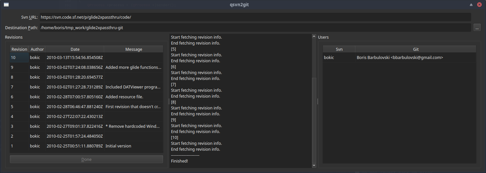

# qsvn2git
---
svn to git migration GUI app.

This small **experimental** tool will try to convert svn to git project. Currently tested on small projects. **Use it on your risk.**

TODO:
* Code cleanup and refactor.
* Improve UI state.
* Convert svn branches as well.
* Convert svn tags.

